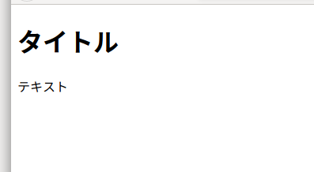

Webページは単なるテキストファイルで、テキストをHTMLタグで囲むことによって構文を表現します。  
まずは簡単なWebページを作ってみましょう。
はじめに、適当な名前のフォルダを作ってください。
次にそのフォルダの中に、index.htmlというテキストファイルを作ります。
そして、テキストファイルに、下記のテキストをコピペして、保存してください。

```
<!DOCTYPE html>
<html>
  <head>
    <meta charset="utf-8">
    <title>タイトル</title>
  </head>
  <body>
    <h1>タイトル</h1>
    <p>テキスト</p>
  </body>
</html>
```
このファイルを開くと、ブラウザが立ち上がり、  

  

このように出力されると思います。
## タグ,属性,要素
リンクの書き方
<p></P>

## 参考文献