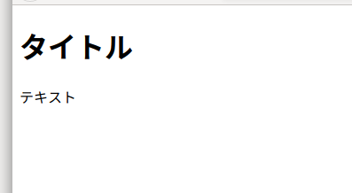

Webページは単なるテキストファイルで、テキストをHTMLタグで囲むことによって構文を表現します。  
まずは簡単なWebページを作ってみましょう。
はじめに、適当な名前のフォルダを作ってください。
次にそのフォルダの中に、index.htmlというテキストファイルを作ります。
そして、テキストファイルに、下記のテキストをコピペして、保存してください。


```html
<!DOCTYPE html>
<html>
  <head>
    <meta charset="utf-8">
    <title>タイトル</title>
  </head>
  <body>
    <h1>タイトル</h1>
    <p>テキスト</p>
  </body>
</html>
```
このファイルを開くと、ブラウザが立ち上がり、  

  

このように出力されると思います。
<div class="note">
<p>
インデックスというのは...
</p>
</div>

### DOCTYPE宣言
HTML文章の最初は、<code><!DOCTYPE html></code>で始めます。
これは、この文書がHTML5で書かれていることを宣言しています。
## HTMLの要素
開始タグで始まり、終了タグで終わるひとまとまりの事をHTMLの要素といいます。  
さきほどの、HTML文書について説明すると、  


- <code>html</code>要素は文書のはじめと終わりを示します。
- <code>head</code>要素は文書のメタデータを内包する要素です。
- <code>meta</code>要素は文書のメタデータを指定します。
- <code>title</code>要素は
- <code>body</code>要素は
- <code>h1,h2,h3,h4,h5,h6</code>要素はセクションの見出しを表します。
- <code>p</code>要素は

### 属性
リンクの書き方
## 画像の挿入
画像を挿入するには、`` タグを使います。

```

```
<ul> 
  <li>src属性は画像のリンク先を示します。<br>
    <div class="note">
      <p>ブログで言えば、画像ファイルの置き場所は一つ一つの記事ごとにフォルダをつくり、その中にindex.htmlのファイルとimageファイルを置くやり方と、ルートフォルダにimageフォルダを作り、そこに全ての画像をまとめてしまう方法があります。私としては、管理のしやすさから前者をおすすめします。サイト全体に使う画像などなら後者のほうがいいかもしれません。</p>
    </div>
  </li>
  <li>width属性は画像の横幅をピクセル値で表します。</li>
  <li>height属性は画像の縦幅をピクセル値で表します。</li>
</ul> 

## マークダウン
マークダウンとは、HTMLを簡略化したマークアップ言語です。マークダウンで書いた文書は表示するときはHTMLに変換されて表示されます。そのような長所から、記事を書くのに適しています。  
最近では、QiitaやGithubのデフォルトのノートとしても使われていることから、人気が出てきていることがわかります。

### 段落と改行


## 参考文献
[HTMLの要素](http://itref.fc2web.com/html/element.html)  
[HTML 要素リファレンス](https://developer.mozilla.org/ja/docs/Web/HTML/Element)
[Markdown Guide](https://www.markdownguide.org/)
## リンク
[ビバ★りずむ](https://bibabosi-rizumu.com/)