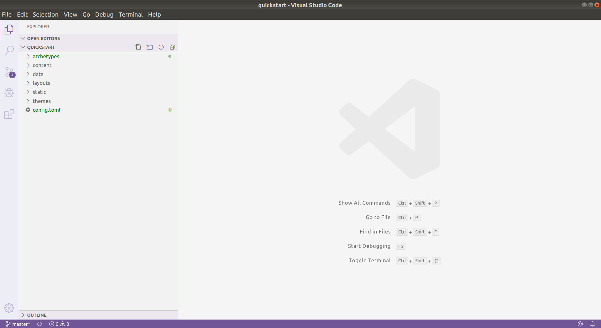
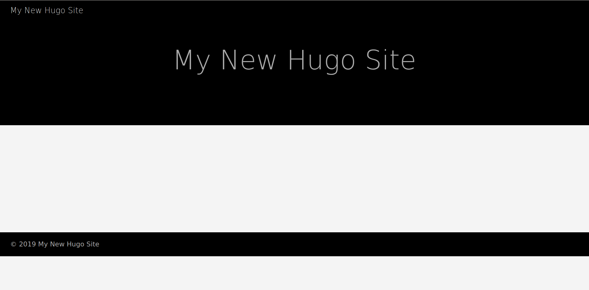

[Hugo](https://gohugo.io/)は静的サイトジェネレータのうちの一つです。それではHugoを使ってブログを作っていきましょう。


## はじめに
はじめに、Hugoをインストールします。
```
wget https://github.com/gohugoio/hugo/releases/download/v0.58.2/hugo_0.58.2_Linux-64bit.deb
```  
```
dpkg -i hugo_0.58.2_Linux-64bit.deb
```  

これで一応の準備は整ったので、ブログを作ってみましょう。
```
hugo new site quickstart
```  
これで、ホームディレクトリにquickstartフォルダが作られました。  
このquickstartフォルダをVSCodeで開いてみると、次のようになると思います。

  

ブログのレイアウトはlayoutフォルダにindex.htmlファイルを作って保存します。

```html
<!DOCTYPE html>
<html>
  <head>
    <meta charset="utf-8">
    <title>My first page</title>
  </head>
  <body>
    <h1>はじめに</h1>
    <p>これは、練習用のページです。</p>
  </body>
</html>
```

CSSはstaticフォルダにcssフォルダを作って保存します。

<pre class="pre-scrollable">
body {
    width: 1170px;
    margin-right:auto;
    margin-left:auto;
    padding-left:15px;
    padding-right:15px;
}
nav ul, footer ul {
    font-family:'Helvetica', 'Arial', 'Sans-Serif';
    padding: 0px;
    list-style: none;
    font-weight: bold;
}
nav ul li, footer ul li {
    display: inline;
    margin-right: 20px;
}
a {
    text-decoration: none;
    color: #999;
}
a:hover {
    text-decoration: underline;
}
h1 {
    font-size: 3em;
    font-family:'Helvetica', 'Arial', 'Sans-Serif';
}
p {
    font-size: 1.5em;
    line-height: 1.4em;
    color: #333;
}
</pre>

ブログを開くには、VSCodeからターミナルを開いて、
```
hugo server
```
と入力し、ブラウザで**[http://localhost:1313/](http://localhost:1313/)**を開くと、ページが表示されます。

## ブログの追加
ブログの記事はcontentフォルダに追加します。
```
+++
title: 初めてのブログ
date: 2019-12-29
type: blog
+++
練習用ブログポスト
```
ブログの一覧を表示するために先程作ったindex.htmlに、次のコードを続けて書きます。

<pre class="pre-scrollable">
&#123;&#123; define "main" &#125;&#125;
&lt;main&gt;
    &lt;artcicle&gt;
        &lt;header&gt;
            &lt;h1&gt;&#123;&#123;.title&#125;&#125;&lt;h1&gt;
        &lt;header&gt;
        &#123;&#123;.Content&#125;&#125;
    &lt;artcicle&gt;
    &lt;ul&gt;
    &#123;&#123; range .Pages &#125;&#125;
        &lt;li&gt;
             &lt;a href="&#123;&#123;.Permalink&#125;&#125;"&gt;&#123;&#123;.Date.Format "2006-01-02"&#125;&#125; | &#123;&#123;.Title&#125;&#125;&lt;/a&gt;
        &lt;/li&gt;
    &#123;&#123; end &#125;&#125;
     &lt;/ul&gt;
&lt;/main&gt;
&#123;&#123; end &#125;&#125;
</pre>

<!--
## テーマの読み込み
```
$ cd quickstart
$ git init
$ git submodule add https://github.com/budparr/gohugo-theme-ananke.git themes/ananke
$ echo 'theme = "ananke"' >> config.toml
```

 
-->
##  参考文献
[Hugo](https://gohugo.io/)  
[Hugo/QuickStart](https://gohugo.io/getting-started/quick-start/)  
[ubuntu 16.04 LTSに最新のhugoをインストールする方法](http://note.mokuzine.net/hugo-install-ubuntu-1604-lts/)  
[How to Install Hugo Site Generator On Ubuntu 18.04 LTS](https://www.howtoforge.com/how-to-install-hugo-site-generator-on-ubuntu/)  
[Jekyll](https://jekyllrb.com)  
[Creating and Hosting a Personal Site on GitHub](http://jmcglone.com/guides/github-pages/)  
[外から見る日本、見られる日本人](http://blog.livedoor.jp/fromvancouver/)