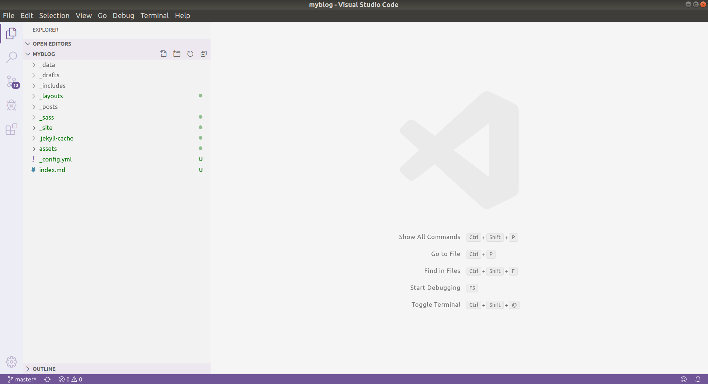
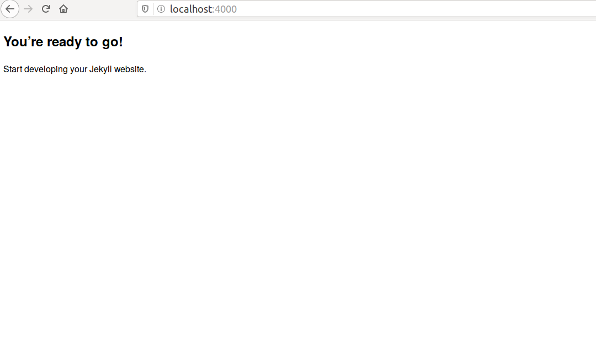

[Hugo](https://gohugo.io/)は静的サイトジェネレータのうちの一つです。


## はじめに
はじめに、Hugoをインストールします。
```
sudo apt-get install hugo
```  
<!--Tips Bundler

-->
これで一応の準備は整ったので、ブログを作ってみましょう。
```
hugo new site quickstart
```  
これで、ホームディレクトリにquickstartフォルダが作られました。  
このquickstartフォルダをVSCodeで開いてみると、次のようになると思います。

  
ブログを開くには、VSCodeからターミナルを開いて、
```
hugo server -D
```
と入力し、ブラウザで**[http://localhost:1313/](http://localhost:1313/)**を開くと、次のようなブログ?が表示されます。

  

## テンプレートの読み込み

##  参考文献
[Hugo](https://gohugo.io/)  