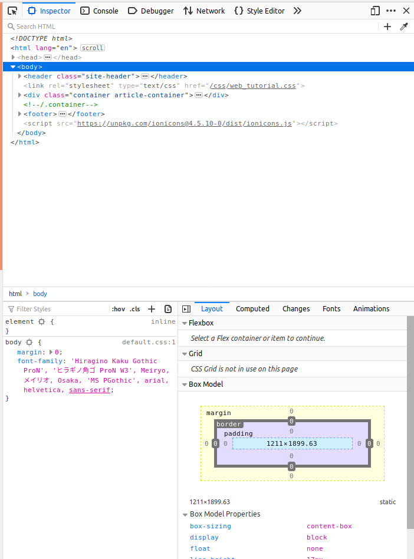

Webサイトを作るためのツールについて見ていきます。
## ブラウザ
HTMLファイルを表示するには、ブラウザが必要です。
ブラウザには、Windowsだと、Internet ExplorerやMicrosoft Edge、Google ChomeやFirefoxがあります。
ここでは、Firefoxを使って説明していきます。おそらくChomeユーザーが多いでしょうが、FirefoxでできることはChomeでもできるでしょうから、試してみてください。

FirefoxでHTMLファイルを開くには、メニューボタンから、ファイルを開くというメニューを選択して開くか、直接ファイルをドラッグ&ドロップすると開けます。

### デベロープメントツール
ウェブページを調べるには、デベロープメントツールを使います。デベロープメントツールを使うには　何らかのHTMLファイルを開いた状態で、メニューボタンから選ぶか、ctrl+shift+Iを押すと、次のような画面が現在の画面に追加して表示されます。 

  

## エディタ
HTMLファイルはテキストエディタでも書くことが出来ますが、利便性を考えてIDEを使うことをおすすめします。
IDEとはIntegrated development environmentの略で、テキストエディタを進化させたようなものです。
IDEはプログラミングするときにも使うので、今のうちに慣れておくと便利です。  
IDEには色々ありますが、Microsoftが出しているVisual Studio Code(無料)をここではおすすめしておきます。
VSCode以外では、AtomやBracketなどのIDEがあります。